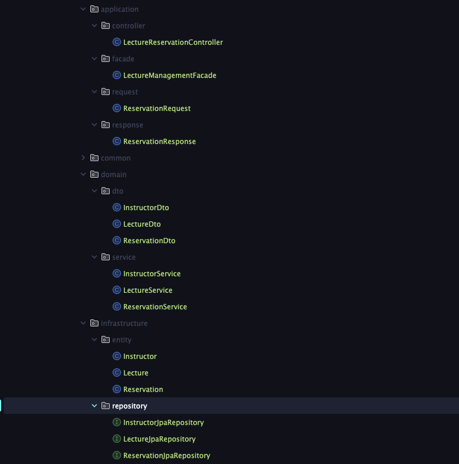
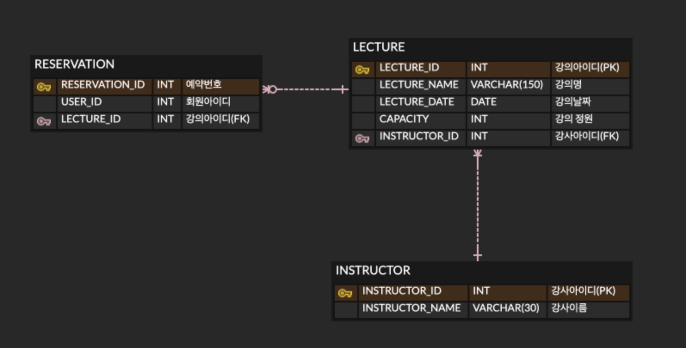

# 체크리스트

## Default
- [x] 아키텍처 준수를 위한 애플리케이션 패키지 설계

### 패키지 구조 설명
  - 각 계층의 책임을 명확히 분리하고자 설계했습니다.

1. application
사용자 요청을 처리하고 비즈니스 로직을 조정하는 계층입니다. 컨트롤러와 파사드가 포함되어 있어, 클라이언트와 비즈니스 로직 간의 상호작용을 관리합니다.
2. common
애플리케이션 전반에서 공통적으로 사용하는 기능을 제공하거나, 예외 처리를 담당하는 계층입니다. 여러 계층에서 반복적으로 사용되는 코드를 효율적으로 관리합니다.
3. domain
애플리케이션의 핵심 도메인 모델과 관련된 로직을 처리하는 계층입니다. 도메인 객체의 DTO(데이터 전송 객체)와 각 비즈니스 로직을 처리하는 서비스가 포함됩니다.
4. infrastructure
데이터베이스와의 상호작용을 담당하는 계층입니다. 엔티티 클래스와 레포지토리 클래스가 위치하며, 데이터베이스의 CRUD 작업을 처리합니다.

- [x] 특강 도메인 테이블 설계 및 목록/신청 등 기본 기능 구현
- [x] 각 기능에 대한 단위 테스트 작성

## STEP 3
- [x] 설계한 테이블에 대한 ERD 및 이유를 설명하는 README 작성
- [x] 선착순 30명 이후의 신청자의 경우 실패하도록 개선

1. LECTURE와 INSTRUCTOR 간의 일대다 관계:
    - 한 명의 강사가 여러 강의를 개설할 수 있다는 점에서 일대다(Many-to-One) 관계로 설정했습니다.  
      LECTURE 테이블은 INSTRUCTOR 테이블의 외래 키를 가지고 있고, 강의는 항상 특정 강사와 연결됩니다.

2. RESERVATION 테이블을 통해 유저의 신청 관리:

    - RESERVATION 테이블은 유저가 특정 강의를 신청하면 이를 저장하는 중간 테이블로서 기능합니다.  
      유저가 강의를 신청할 때 LECTURE ID와 함께 저장합니다.

3. 연관 관계를 통한 데이터 조회:
    - 강의를 신청한 후에, 예약 목록을 조회할 때 LECTURE 테이블의 ID를 통해 RESERVATION 테이블과 LECTURE 테이블 간의 관계를 이용하여 데이터를 쉽게 조회하고,  
      LECTURE 테이블의 외래 키로 가지고 있는 INSTRUCTOR ID를 활용해 강사의 정보도 조회할 수 있도록 설계했습니다.

---